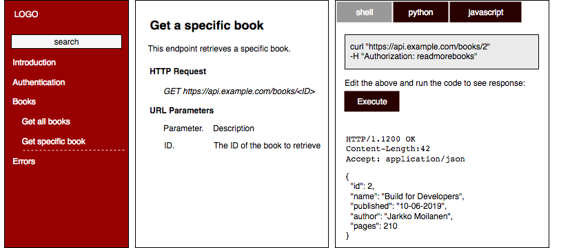

# Documentation

All APIs must be documented as if it would go public in the future. API documentation must be understandable, coherent and complete as is. 

## API Description formats

* Internally we use  RAML due to development pipeline and data model complexity and reuse. 
* For exposed APIs we publish [Open API Spec](https://github.com/OAI/OpenAPI-Specification) format \([v2](https://github.com/OAI/OpenAPI-Specification/blob/master/versions/2.0.md)\) in API Documentation. 
  * For this purpose RAML spec \(+ includes\) must be in folder following the API name.
  * Example: Product API is in `product-api` folder in [https://github.com/PlatformOfTrust/docs/tree/master/raml2markdown/src](https://github.com/PlatformOfTrust/docs/tree/master/raml2markdown/src) 

## Getting started packages

Each API must have getting started package which enables first great experience in under 3 minutes. The package can be implemented as part of the documentation described below or as separate section in Developer Portal. 

Package shows how most common feature of the API is used. Package must contain runnable conde examples. Developer can choose whether to run code in browser \(provided always\) or in command-line in own machine. Result must be identical in both cases. On top of the code, API response with headers \(and possible errors\) must be visible to the user. 

Getting started package utilizes sandbox provided by the PoT. Any code run in Getting started package is run only in snadbox environment, never in production environment. 

## 3-column documentation

In API documentation we follow the path of most developer friendly documentation which is based on 3 columns. The left is reserved for TOC. Middle part is the description part \(endpoint, function, feature\). The part must contain also business reasons to apply API. The right column is for runnable code examples with selected programming languages.  

The right part which contains code examples is utilizing sandbox environment provided for all registered developers. Developer can edit the API call \(in the above example curl based call\), push "execute" button and see the server response with headers below. 

